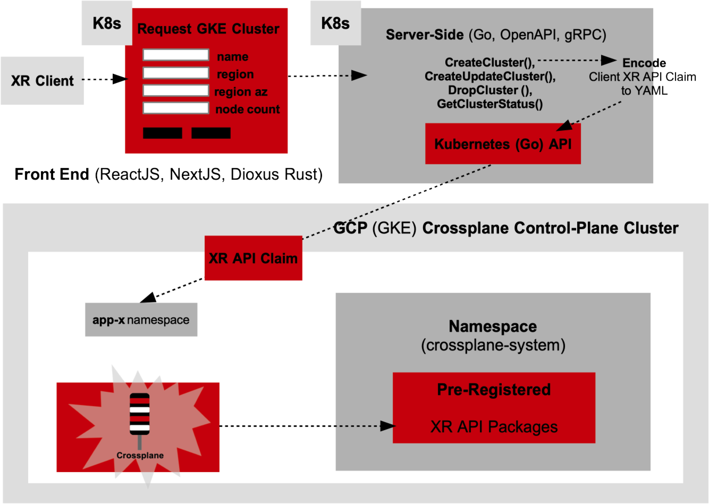

# Crossplane API, Cluster API and ArgoCD (Control Plane) Cluster for Provisioning GCP Container App Platforms
Crossplane, Crossplane GCP Provider and ArgoCD Kubernetes-Native Provisioning of GCP GKE, GCP Cloud Run and GCP App Engine Drone Attack Sortie App Services (Rust and Go)


## Archictural Workflow of CNCF Kubernetes-Native Resources Provisioning (Crossplane and ArgoCD)

Crossplane provides a Control-Plane-Oriented (CPO) GitOps-driven auto-drift-detection and auto-drift-delta reconcilation with defensive regulative guards to prevent sidedoor changes NOT recorded in Git as the source of truth. Crossplane uses "Control-Theory" state-machine logic to constantly analyze the desired state of resource configuraitions in Git and auto-sync (reconcile) the differences to guarantee the live state (the live state of cloud resources or scoped resources in Kubernetes Clusters such as cluster apps and cluster add-ons are gang-synced without drift gaps).

Crosspane API resources are driven to Git as Kubernetes Custom Resources using its CRDs that are installed on the Kubernetes Cluster. Crossplane is extended to a full GitOps driven workflow referencing a GitOps agent controller to coordinate the auto-drift detection changes in Git that deviate from the live state in the cloud or Kubernetes workload Clusters. These Kubernetes-Native GitOps agents are.

- ArgoCD with ApplicationSet Controller to provision at-scale ArgoCD Applications along with a Progressive Delivery agent such as Argo Rollouts (for doing red-black deployments...).

- FluxCD to provision at-scale Flux `Kustomizations` along with a Progressive Delivery agent such as  FluxCD Flagger (for doing red-black deployments ...).

There is no non-declarative approach to delivery, unlike non-declarive CI/CD workflows with Terraform that are NOT GitOps.

- Terraform Plan/Apply workflows in (GitHub Actions CI/CD Workflows, GitLab CI/CD Pipelines ...) even if included with `.precommit` Git checks,Terraform resource code policy checks in the workflows using CNCF `Checkov` (see checkov.io) where the Terraform Plan workflow artifact is cached persisted and PR approved to trigger the Terraform Apply workflow. 

- Terraform IF coupled with a Kubernetes GitOps controller such as ArgoCD Terraform GitOps Controller or FluxCD Terraform GitOps Controller to watch Git for Terraform configuration changes pushes Terraform closer to GitOps delivery cycle however it is still half-GitOps (not fully). This is Half-Ops. This is the ceiling to Terraform.

As clients call on pre-recorded to Git Terraform modules using `module` syntax and juxtapose these modules (modules interconnected as its outputs are inputs to the next module) all called from the root module (the client through the GitFlow pipelines), the clients are faced with the high-cognitive load of understanding Terraform. Terraform does **NOT** allow low-cognitive load for application groups to self-service and deliver the autonomy without the assistance of platform service groups to intervene and slow velocity of delivering their application required resources. To aid this handicap, work is required to provide low-cognitive load service catalog driven headless CLIs or UI dashscreens to provide inventory selection that accepts only high-level client input of what is required to provision while all the high-cognitive lower-level details of the resource configurations are pre-packaged in Git (Terraform modules) and done at the platform servicing group level. The platform developer groups are slowed as they cannot fully dedicate concentrate on only providing resource APIs while constantly guiding and supervising application groups through the process of deploying their resources. The separation of concerns worklfows are not divided.

Crossplane provides a `claim` as serving as a requests for a resource or a coordinated workflow of resources. The clients (application groups) do NOT need to know anything of Crossplane or Kubernetes. The clients would correcty call on a headless CLI to prompt for high-level application-specific inputs or a web-driven UI dashscreen to pull for high-level high-level application-specific inputs using a `Service Options Configuration` design pattern and dispatch this required collection of selected resources to Git. This API takes the collection of inputs, packages its expertise in the configuration and writes this as a Crossplane CR API claim to Git. This packaging processs requires high-degree of opinionated decision proceesing as all of the expertise to provision this is lifted away from application groups. The Crossplane CR API claim or collection of CR API claims written (pushed) to Git triggers ArgoCD to auto-deploy the collected Crossplane requests to create the entire resouces to the target (cloud resources or cloud offered Kubernetes clusters or even off-cloud Kubernetes clusters). Crossplane can create VMs off-cloud, VMs on-cloud and VPCs, storage resources that Terraform can provide without any explicit CI/CD workflows to acheive the results. The workflow is pure Gitflow.

This Kubernetes-Native way of provisioning resources against higher-cognitive templated ways using Terraform is the only way to provide self-service delivery of cloud and Kubernetes resources at-scale and disaster recovery awareness.

The Crossplane equivalent structure of Terraform modules is through a templated architecture of packaging as provided in the Git repo. See the next section `Crossplane XRD API Structure`.


## Crossplane XRD API Structure (Helm)
```
├── crossplane -------------------------------------> Deployed to `crossplane-system` namespace
│   ├── Chart.yaml                      
│   ├── packages
│   │   ├── gcp-apigee                  
│   │   │   ├── templates
│   │   │   │   ├── claim.yaml 
│   │   │   │   ├── composition.yaml ---------------> Deployed to Cluster Scope (no target namespace)
│   │   │   │   └── xrd.yaml -----------------------> Deployed to Cluster Scope (no target namespace)
│   │   │   └── values.yaml
│   │   ├── gcp-app-engine
│   │   │   ├── templates
│   │   │   │   ├── claim.yaml
│   │   │   │   ├── composition.yaml ---------------> Deployed to Cluster Scope (no target namespace)
│   │   │   │   └── xrd.yaml -----------------------> Deployed to Cluster Scope (no target namespace)
│   │   │   └── values.yaml
│   │   ├── gcp-cloudrun
│   │   │   ├── templates
│   │   │   │   ├── claim.yaml
│   │   │   │   ├── composition.yaml
│   │   │   │   └── xrd.yaml
│   │   │   └── values.yaml
│   │   ├── gcp-databases
│   │   │   ├── templates
│   │   │   │   ├── gcp-firestore-claim.yaml
│   │   │   │   ├── gcp-firestore-composition.yaml
│   │   │   │   ├── gcp-firestore-xrd.yaml
│   │   │   │   ├── gcp-spanner-claim.yaml
│   │   │   │   ├── gcp-spanner-composition.yaml
│   │   │   │   └── gcp-spanner-xrd.yaml
│   │   │   └── values.yaml
│   │   ├── gcp-eventarc                  
│   │   │   ├── templates
│   │   │   │   ├── claim.yaml
│   │   │   │   ├── composition.yaml
│   │   │   │   └── xrd.yaml
│   │   │   └── values.yaml
│   │   ├── gcp-gke                       
│   │   │   ├── templates
│   │   │   │   ├── claim.yaml
│   │   │   │   ├── composition.yaml ---------------> Deployed to Cluster Scope (no target namespace)
│   │   │   │   └── xrd.yaml -----------------------> Deployed to Cluster Scope (no target namespace)
│   │   │   └── values.yaml
│   │   ├── gcp-networking                
│   │   │   ├── templates
│   │   │   │   ├── claim.yaml
│   │   │   │   ├── composition.yaml
│   │   │   │   └── xrd.yaml
│   │   │   └── values.yaml
│   │   └── gcp-pubsub                    
│   │       ├── templates
│   │       │   ├── claim.yaml
│   │       │   ├── composition.yaml
│   │       │   └── xrd.yaml
│   │       └── values.yaml
│   ├── values-nonprod.yaml
│   ├── values-preprod.yaml
│   ├── values-prod.yaml
│   ├── values-uat.yaml
│   └── values.yaml
├── crossplane-pkg
│   ├── crossplane-pkg-request-cli
│   └── spec-README.md
```

A view into how to provide the packaging for GCP GKE Cluster is provided here with the three required CRs.

- xrd.yaml (CompositeResourceDefinition resource)
- composition.yaml (Composition resource)
- claim.yaml ()

The `XRD` (CompositeResourceDefinition) for GCP GKE Cluster is as follows.

```yaml
apiVersion: apiextensions.crossplane.io/v1
kind: CompositeResourceDefinition
metadata:
  name: xgcpgke.enginevector.io
spec:
  group: gke.enginevector.io
  names:
    kind: XGCPGKE
    plural: xgcpgkes
  claimNames:
    kind: GCPGKEClaim
    plural: gcpgkeclaims
  versions:
    - name: v1alpha1
      served: true
      referenceable: true
      schema:
        openAPIV3Schema:
          type: object
          properties:
            spec:
              type: object
              properties:
                projectId:
                  type: string
                clusterName:
                  type: string
                region:
                  type: string
                nodeCount:
                  type: integer
              required:
                - projectId
                - clusterName
                - region
```

The `Composition` for GCP GKE Cluster is as follows.

```yaml
apiVersion: apiextensions.crossplane.io/v1
kind: Composition
metadata:
  name: gcp-gke
spec:
  compositeTypeRef:
    apiVersion: gke.enginevector.io/v1alpha1
    kind: XGCPGKE
  resources:
    - name: gke-cluster
      base:
        apiVersion: container.gcp.crossplane.io/v1beta1
        kind: Cluster
        spec:
          forProvider:
            location: {{ .Values.gke.region }}
            initialNodeCount: {{ .Values.gke.nodeCount }}
            networkRef:
              name: {{ .Values.gke.networkRef }}
          providerConfigRef:
            name: {{ .Values.gke.providerConfig }}
      patches:
        - fromFieldPath: "spec.clusterName"
          toFieldPath: "metadata.name"
        - fromFieldPath: "spec.region"
          toFieldPath: "spec.forProvider.location"
        - fromFieldPath: "spec.nodeCount"
          toFieldPath: "spec.forProvider.initialNodeCount"

    - name: gke-nodepool
      base:
        apiVersion: container.gcp.crossplane.io/v1beta1
        kind: NodePool
        spec:
          forProvider:
            clusterRef:
              name: {{ .Values.gke.clusterName }}
            locations:
              - {{ .Values.gke.region }}
            autoscaling:
              minNodeCount: {{ .Values.gke.nodePool.minNodeCount }}
              maxNodeCount: {{ .Values.gke.nodePool.maxNodeCount }}
            management:
              autoRepair: {{ .Values.gke.nodePool.autoRepair }}
              autoUpgrade: {{ .Values.gke.nodePool.autoUpgrade }}
            config:
              machineType: {{ .Values.gke.nodePool.machineType }}
              diskSizeGb: {{ .Values.gke.nodePool.diskSizeGb }}
              diskType: {{ .Values.gke.nodePool.diskType }}
              labels: {{ .Values.gke.nodePool.labels }}
              taints: {{ .Values.gke.nodePool.taints }}
          providerConfigRef:
            name: {{ .Values.gke.providerConfig }}
      patches:
        - fromFieldPath: "spec.clusterName"
          toFieldPath: "spec.forProvider.clusterRef.name"
```

The `Claim` for GCP GKE Cluster is as follows.

```yaml
apiVersion: gke.example.com/v1alpha1
kind: GCPGKEClaim
metadata:
  name: gke-claim
spec:
  projectId: {{ .Values.projectId }}
  clusterName: {{ .Values.gke.clusterName }}
  region: {{ .Values.gke.region }}
  nodeCount: {{ .Values.gke.nodeCount }}
```

The **values.yaml** file for the GCP GKE subchart Crossplane will deploy as it sees a new XR API Claim pushed
to the Crossplane Control-Plane Cluster is here.

```yaml
projectId: "cxp-gcp"

gke:
  clusterName: "gke-cluster"
  region: "us-west4"
  nodeCount: 3
  networkRef: "shared-vpc"
  providerConfig: "gcp-provider"
  nodePool:
    name: "default-node-pool"
    machineType: "n1-standard-1"
    diskSizeGb: 100
    diskType: "pd-standard"
    minNodeCount: 1
    maxNodeCount: 3
    autoRepair: true
    autoUpgrade: true
    labels:
      environment: "nonprod"
      team: "platform-engineering"
    taints:
      - key: "node-type"
        value: "infra"
        effect: "NO_SCHEDULE"
```

The `crossplane/` directory is the parent Helm Chart.

- The parent Helm Chart contains its over-arching `Chart.yaml` file, a `default` values.yaml file and a range of `values-{env}.yaml` subchart overrides values files.

- The parent Helm Chart acts as a single-point-of-configuration for all subcharts.


The `crossplane/packages/gcp/gcp-*/`are the child Helm Charts (subcharts).

- The child Helm Charts **DO NOT** need their own `Chart.yaml`.
- The child Helm Charts provides own `values.yaml` which gets overriden at the parent-level values-*.yaml **IF** the parent provides default values.


Helm sees `crossplane/packages/gcp/gcp-*` as **logical subcharts**.

- Instead of using Helm `dependencies` construct (in the Chart.yaml) this structure treats the subcharts as 
packaged resources.

- The parent Helm release (`crossplane/`) applies all the `gcp-*` Helm Charts in one go. The exception is to provide on/off conditional feature flags to cherrypick specific subcharts (ONLY GCP GKE).


To keep all values.yaml overrides as first class citizen to the subcharts, only the parent values.yaml will just provide an over-arching `projectId`. Each subchart will reference its own values.yaml.


**This pattern of Crossplane resources follows in the rest of the 10 GCP resources.**


To provision the resources to Git and trigger ArgoCD to deploy the GCP resources to target GCP cloud project the following workflow is.


```shell
cd crossplane-pkg/crossplane-pkg-request-cli
cargo run -- request --project-name drone-colony \
  --gke \
  --cloudrun \
  --appengine \
  --apigee \
  --spanner \
  --firestore \
  --pubsub \
  --eventarc \
  --networking \
  --iam
```

Profile of the proceeding CLI issuance is as follows.

- `--project-name drone-colony` Assigns a unique name to all claims.
- `--gke` Creates GKE Cluster Claim (gcp-gke-claim.yaml in `crossplane-pkg/`)  
- `--cloudrun` Creates Cloud Run Service Claim (gcp-cloudrun-claim.yaml in `crossplane-pkg/`)
- `--appengine` Creates App Engine Claim (gcp-appengine-claim.yaml in `crossplane-pkg/`)
- `--apigee` Creates Apigee API Gateway Claim (gcp-apigee-claim.yaml in `crossplane-pkg/`)
- `--spanner` Creates Spanner DB Claim (gcp-spanner-claim.yaml in `crossplane-pkg/`) 
- `--firestore` Creates GCP Firestore Database Claim (gcp-firestore-claim.yaml in `crossplane-pkg/`)
- `--pubsub` Creates GCP Pub/Sub Claim (gcp-pubsub-claim.yaml in `crossplane-pkg/`)
- `--eventarc`  Creates GCP EventArc Trigger Claim (gcp-eventarc-claim.yaml in `crossplane-pkg/`)
- `--networking` Creates Networking (VPC, Firewall, Private Link Claim (gcp-networking-claim.yaml in `crossplane-pkg/`)
- `--iam` Creates IAM Permissions Claim (gcp-iam-claim.yaml in `crossplane-pkg/`)

This uses the `Multple Claim Crossplane Model`.


## Crossplane XRD API Request (Claim) Architecture Workflow

**For GCP CXP Deployments**

- (Platform Expert) Create Private GCP GKE CXP Cluster with GCP IAM Workload Identity (Terrform)
- (Platform Expert) Run Helm Chart for CXP Provider Configuration Chart

- (Client) Create XR API Claim to Push to CXP Cluster
  - `kubectl apply -f gcpgke-claim.yaml`
- (Client) Verify XR API Claim Deploy to CXP Cluster
  - `kubectl get gcpgke-claims` 


**To drop/delete all provisoned client resources through the XR API Claim**

```shell
kubectl get gcpgke-claims
```

Delete the XR API Claim Resources.

```shell
kubectl delete gcpgke-claims gke-cluster-claim
```

Verify the GCP Resources Deletion.

```shell
kubectl get managed
```
This lists all managed GCP resources under Crossplane control. Once the list is empty, all resources are deleted.
Verification in the GCP Portal of the GKE cluster is deleted.


**Force** Deletion of GCP (GKE) Resources (using **kubectl**)

```shell
kubectl get managed
kubectl delete managed <resource-name>
```

**Force** Deletion of GCP (GKE) Resources (using **GCP gloud CLI**)

```shell
gcloud container clusters delete <gke-cluster-name> --region=us-west4 --project=cxp-gcp
```


**For Azure CXP Deployments**

In-Progress


## Registering XR API Packages to Crossplane (Platform Architecture Side)

The following workflow and graphical diagrams will follow the sequence of **registering** the Crossplane XR API packagesto the active Crossplane (AWS EKS) Control-Plane Cluster.

## Registering/Requesting XR API to Crossplane (Product Side)

The following workflow and graphical diagrams will follow the sequence of **registering/requesting** the Crossplane XR API packages
to the active Crossplane (AWS EKS) Control-Plane Cluster through the client facing `XR API Claim`.

##

##


## Provisioning XR APIs to Crossplane Workflow Architectures

The following section drills over in-depth the two approaches clients request their Crossplane XR API Claims to Crossplane Control-Plane
Cluster. The two approaches differ on fidelity of GitOps tracking the requests for cloud reources desired and the sequential routes each of these
two approaches do it.

- GitOps **First** Approach (Crossplane Control-Plane Cluster in conjunction with **ArgoCD** or `FluxCD`)
- GitOps **Last** Approach (Crossplane Control-Plane Cluster **NOT** conjunction with ArgoCD or `FluxCD`)

### GitOps First Approach

The `GitOps First Approach` involves an architecture of the Crossplane Control-Plane Cluster working in conjunction with
GitOps Agent ArgoCD to track all Crossplane XR API Claim requests enroute to a Git repository preregistered with ArgoCD to track Git recordings prior to
ArgoCD dispatching the changes through Crossplane. This approach does **NOT** provide serving streamlined Crossplane XR API Claim requests directly to the
Crossplane Control-Plane Cluster directly. This approach does provide higher-grade Git auditing, tracking and Git transaction reversal in the occurance of any
failed reconciliation events.

The GitOps First Approach the Crossplane Control-Plane Cluster will require careful capacity planning of the required
CLuster resources (CPU, CPU Cache and Memory) and logical VPC AZ planning that reduce and severly risk HA in low-latency network connections to avoid
Crossplane and in-particular ArgoCD service disruption.

### GitOps Last Approach

The `GitOps Last Approach` involves an architecture of the Crossplane Control-Plane Cluster without a GitOps Agent (ArgoCD or FluxCD). This approach does provide serving streamlined Crossplane XR API Claim requests directly to the
Crossplane Control-Plane Cluster directly. This approach does **NOT** provide higher-grade Git auditing, tracking and Git transaction reversal in the occurance of any
failed reconciliation events.

## Upgrading Lifecycle of Crossplane Control Plane Cluster (API Versioning Clusters)

In-Progress


## GCP Applications (GCP GKE App, GCP CloudRun App, GCP AppEngine App*)

The following applications are provided for this project.

- Double A*Star Pathfinding Drone Sortie Tracking and Status for GCP GKE App
    - Double A*Star Algorithm is a derivative of Ant Colony (Follow-the-Leader) Variant
    - Developed in **Rust** 
    - Runs autonomously without external API requests.
    - Stores sortie status progressions to GCP Spanner DB
        - Syncs to GCP Spanner DB at 25 Waypoint Radio Towers
    - Provides the following project crates:
        - `drones` Drone Convoy Sortie Logic
        - `data-storage` Structs, GCP Spanner Connections, Read/Write APIs

- Double A*Star Pathfinding Drone Sortie Tracking and Status for GCP CloudRun App
    - Double A*Star Algorithm is a derivative of Ant Colony (Follow-the-Leader) Variant
    - Developed in **Rust**
    - Runs autonomously without external API requests.
    - Stores sortie status progressions to GCP Firestore NoSQL DB
        - Syncs to GCP Firestore DB at 25 Waypoint Radio Towers

**See for Git Addition**
- Double A*Star Pathfinding Drone Sortie Tracking and Status for GCP AppEngine App
    - Double A*Star Algorithm is a derivative of Ant Colony (Follow-the-Leader) Variant
    - Developed in **Go**
    - Runs autonomously without external API requests.
    - Stores sortie status progressions to GCP Firestore NoSQL DB
        - Syncs to GCP Firestore DB at 25 Waypoint Radio Towers


## Installing Crossplane and Crossplane Control-Plane Architecture w/ ArgoCD

To install `Crossplane` in HA configuration using the official Helm Chart.

```shell
helm repo add crossplane-stable https://charts.crossplane.io/stable
helm repo update

helm install crossplane crossplane-stable/crossplane \
  --namespace crossplane-system \
  --create-namespace \
  --set 'args[0]=--enable-composition-revisions' \
  --set replicas=1 \
  --set podDisruptionBudget.enabled=true \
  --set podDisruptionBudget.minAvailable=2 \
  --set leaderElection=true \
  --set rbacManager.deploy=true \
  --set securityContext.runAsNonRoot=true \
  --set 'tolerations[0].key=CriticalAddonsOnly' \
  --set 'tolerations[0].operator=Exists' \
  --set 'tolerations[1].key=node-role.kubernetes.io/control-plane' \
  --set 'tolerations[1].operator=Exists'
```

To install without the Pod `tolerations` the Helm install changes to.

```shell
helm install crossplane crossplane-stable/crossplane \
  --namespace crossplane-system \
  --create-namespace \
  --set 'args[0]=--enable-composition-revisions' \
  --set replicas=1 \
  --set podDisruptionBudget.enabled=true \
  --set podDisruptionBudget.minAvailable=2 \
  --set leaderElection=true \
  --set rbacManager.deploy=true \
  --set securityContext.runAsNonRoot=true
```

Or without `PodDisruptionBudget` for nonprod evalations.

```shell
helm install crossplane crossplane-stable/crossplane \
  --namespace crossplane-system \
  --create-namespace \
  --set 'args[0]=--enable-composition-revisions' \
  --set replicas=1 \
  --set podDisruptionBudget.enabled=true \
  --set podDisruptionBudget.minAvailable=2 \
  --set leaderElection=true \
  --set rbacManager.deploy=true \
  --set securityContext.runAsNonRoot=true
  ```

  Or to drop the CPU for lower-spec Cluster Nodes.

```shell
helm upgrade crossplane crossplane-stable/crossplane \
  --namespace crossplane-system \
  --set 'args[0]=--enable-composition-revisions' \
  --set replicas=1 \
  --set podDisruptionBudget.enabled=false \
  --set rbacManager.deploy=true \
  --set rbacManager.resources.requests.cpu=25m \
  --set rbacManager.resources.requests.memory=64Mi \
  --set rbacManager.resources.limits.cpu=50m \
  --set rbacManager.resources.limits.memory=128Mi \
  --set securityContext.runAsNonRoot=true \
  --set resources.limits.cpu=250m \
  --set resources.limits.memory=512Mi \
  --set resources.requests.cpu=50m \
  --set resources.requests.memory=128Mi
```

Verify the CPU resources for the crossplane `rbacManager` deployed.

```shell
kubectl get pod crossplane-rbac-manager-564687c9dd-s96x9 -n crossplane-system -o=jsonpath='{.spec.containers[*].resources}'
```


### Pre-Verifcation of Exiting GCP IAM Workload Identity (WID) GKE Cluster (Pre-Created GKE Cluster)

**(1) Verify GCP IAM WID is associated on the GKE Cluster**
```shell
gcloud container clusters describe <cluster-name> \
  --zone <zone> \
  --project <project-id> \
  --format="value(workloadIdentityConfig.workloadPool)"
```

**Expected** result.

```shell
project-id.svc.id.goog
```

If this is **null** this is a show stopper until reconfigured.


**(2) Check for Service Accounts exist in ESO namespace**

```shell
kubectl get sa -n external-secrets
```

Find the ServiceAccount ESO is using. Then do.

```shell
kubectl get sa <eso-sa> -n external-secrets -o yaml
```

The expected `annotation` is.

```shell
annotations:
  iam.gke.io/gcp-service-account: *-gsa@project.iam.gserviceaccount.com  # *-gsa is a placholder for actual gsa name
```

- IF it is **NOT** present, ESO is **NOT** using GCP IAM WID.
- IF it is present, verify the GSA exists.

**(3) Verify the GSA exists**

```shell
gcloud iam service-accounts list --project <project-id>
```

Verify the email matches the annotation showed.


**(4) Verify IAM binding (association) on the GSA**

```shell
gcloud projects get-iam-policy <project-id> \
  --flatten="bindings[].members" \
  --filter="bindings.members:<gsa-email>" \
  --format="table(bindings.role)"
```

Look for the following.

- `roles/iam.workloadIdentityUser`
- `roles/secretmanager.secretAccessor`

IF these are **NOT** present, GCP IAM WID will **NOT** work.


**(5) Show the GCP Secrets**

```shell
gcloud secrets list --project <project-id>
```

Confirm a secret exists that ESO is targeting. Later a `kubectl get externalsecret` to match.

**IF steps 1-5 are verified OK**, then Crossplane GCP Control Plane Helm Chart can get installed.


## Cloud Service Account and Crossplane ProviderConfig Workflow

### GCP Workflow

Provisioning GCP service account credentials for the Crossplane `ProviderConfig` is done using a GCP IAM Workload Identity and a Kubernetes Secret using **Kubernetes-Native** `External Secrets Operator` (ESO `ClusterSecretStore` CR and ESO `ExternalSecret` CR).

The workflow is as follows.

Crossplane will reference a Kubernetes ExternalSecret resource that will generate a GCP IAM Workload Indentity Credential. This credential is short-lived and does NOT require additional resource as GCP Cloud Secrets Manager to query at the point of Crossplane ProviderConfig deployment.


**The Crossplane Control-Plane Cluster using GCP GKE**

This version of using Crosslane will provision a GCP GKE Kubernetes Cluster as the Crossplane Control-Plane Cluster with GCP IAM Workload Identity credentials provided. This GCP GKE Crossplane Control-Plane Cluster will drive all XR API Claims to GCP using its included ESO `ExternalSecret` referenced in its Crossplane deployed `ProviderConfig`.  This GCP GKE Crossplane Cluster in-turn would own the leadership of provisioning all GCP cloud resources from this point forward.

To create the GCP GKE Cluster serving as the Crossplane-Control Plane directly provisioning resources in GCP there are three provided approaches.


- Provide a Terraform Module to create a GCP GKE Cluster with an associated GCP IAM Workload Identity Credentials to allow Crossplane (deployed in a second stage) to draw the XR API requested GCP resources.

- Provide a Terraform CDKTF (Cloud Developer Kit Transpiler Framewwork) Module in Go to create a GCP GKE Cluster with an associated GCP IAM Workload Identity Credentials to allow Crossplane (deployed in a second stage) to draw the XR API requested GCP resources.


The workflow(s) use GCP GKE Cluster to associate a GCP IAM Workload Identity Credential to a Kubernetes Service Account (KSA) in stage one. In stage two a `Crossplane GCP GKE Control-Plane Conversion Helm Chart` will convert the GCP GKE Cluster into a Crossplane Control Plane Cluster with the provisionary configurations including the inherited GCP IAM Workload Identity in its Kubernetes Secrets. This Helm Chart depends on Crossplane CRDs getting installed and after this installation, it will deploy the required ESO `ClusterSecretStore` and `ExternalSecret` to register Crossplane to aquire dynamically the GCP IAM Workload Identity Secrets and avoid long-lived secret credentials storage.


**Verify** GCP IAM Workload Identity on GCP GKE Cluster (Pre-Install of Crossplane Control-Plane Configuration Helm Chart)

```shell
gcloud container clusters describe crossplane-control-plane \
  --region us-west4 \
  --format="value(workloadIdentityConfig.workloadPool)"
```

**Verify** IF GSA contains the `iam.workloadIdentityUser` role for the KSA

```shell
gcloud iam service-accounts get-iam-policy gke-crossplane-sa@cxp-gcp.iam.gserviceaccount.com \
  --format=json
```

The association should show.

```shell
{
  "role": "roles/iam.workloadIdentityUser",
  "members": [
    "serviceAccount:cxp-gcp.svc.id.goog[crossplane-system/crossplane-sa]"
  ]
}
```

 **Verify** KSA annotation that links to the GSA

```shell
kubectl get serviceaccount crossplane-sa \
  -n crossplane-system \
  -o jsonpath='{.metadata.annotations.iam\.gke\.io/gcp-service-account}'
```

This should show

```shell
gke-crossplane-sa@cxp-gcp.iam.gserviceaccount.com
```


#### Kubernetes Cluster Configuration (for GCP GKE) for Crossplane


The GCP GKE Crossplane Configuraiton Helm Chart is required to have its dependencies pre-generated prior to deploy
to the GCP GKE Cluster as follows.

The provided `Chart.yaml` is structured as follows.

```yaml
apiVersion: v2
name: crossplane-gcp-control-plane
description: A Helm chart for GCP GitOps Crossplane Control Plane.
type: application
version: 1.0.0
appVersion: "1.0.0"
```


The GCP GKE Crossplane Configuraiton Helm Chart is **NOW** prepared for deploy.

```shell
helm install crossplane-gcp-control-plane \
  ./crossplane-gcp-control-plane-cluster \
  --namespace crossplane-system \
  --create-namespace \
  -f values-gcp-nonprod.yaml
```


To verify the ESO Secrets.

```shell
kubectl get clustersecretstore -A
kubectl get externalsecret -n external-secrets
kubectl get secret gcp-crossplane-creds -n external-secrets -o yaml
```

To verify the Crossplane `GCP ProviderConfig`

```shell
kubectl get providerconfig gcp-provider-config -n crossplane-system -o yaml
```


If `ESO`, `Cert-Manager` and `ArgoCD` already installed on the target Kubernetes Control-Plane Cluster, the `crossplane-gcp-crossplane-provider` Helm Chart provides conditional checks to install only the required.

```shell
helm upgrade --install crossplane-gcp-control-plane ./crossplane-gcp-control-plane \
  --namespace crossplane-system \
  --create-namespace \
  --set argocd.enabled=false \
  --set externalSecrets.enabled=false \
  --set certManager.enabled=false \
  -f values.yaml
```

If `ESO` and `ArgoCD` already installed on the target Kubernetes Control-Plane Cluster the Helm Chart is deployed as follows.

```shell
helm upgrade --install crossplane-gcp-control-plane ./crossplane-gcp-control-plane \
  --namespace crossplane-system \
  --create-namespace \
  --set argocd.enabled=false \
  --set externalSecrets.enabled=false \
  -f values.yaml
```

**Validate ESO and IRSA Post-Deploy**

```shell
kubectl get externalsecret -n external-secrets
kubectl describe externalsecret gcp-crossplane-creds -n external-secrets
```

**Verify Generated Secret Exists**

```shell
kubectl get secret gcp-crossplane-creds -n external-secrets -o yaml
```


The final GCP variant of the Crossplane Provider Helm Chart is as follows.

```shell
crossplane-gcp-control-plane
├── Chart.yaml
├── templates
│   ├── __helpers.tpl
│   ├── crossplane-provider-cluster-secret-store.yaml
│   ├── crossplane-provider-config.yaml
│   ├── crossplane-provider-controller-config.yaml
│   ├── crossplane-provider-external-secret.yaml
│   └── crossplane-provider.yaml
├── values-gcp-nonprod.yaml
├── values-gcp-preprod.yaml
├── values-gcp-prod.yaml
├── values-gcp-uat.yaml
└── values.yaml
```


For production environments that require the Crossplane Control-Plane Cluster in the GCP Cloud running as a GKE Cluster the following workflow will provide how to provision the GCP GKE Crossplane Control-Plane Cluster from a local Crossplane Control-Plane Cluster using a Control-Plane-for-Control-Plane provisioning pattern. 

- Create a GCP GKE Cluster from the GCP GKE Crossplane Control-Plane Cluster through XR API Claim 
- Provide GCP IAM Workload Identity for the created GCP GKE Cluster
- Provision the `crossplane-gcp-control-plane` Helm Chart configuring the ESO Secret for the GCP ProviderConfig 
- Verify this GCP GKE Cluster Crossplane Control-Plane Cluster is finalized to provision GCP resources 


The new GKE cluster is now ready to run Crossplane.


### Azure Workflow (using Azure AKS Cluster for Control-Plane Cluster)

Provisioning Azure Entra ID service account credentials for the Crossplane `ProviderConfig` is done using Azure Entra (previously Azure AD) for the Service Account) and a Kubernetes Secret using Kubernetes-Native `External Secrets Operator` (ESO `ClusterSecretStore` CR and ESO `ExternalSecret` CR) and `Azure Entra ID Federated Workload Identity`. Azure Entra ID natively provides OIDC federation. The Kubernetes Service Account (KSA) is directly associated with the Azure Identity.

**The workflow is as follows.**

Crossplane will reference a Kubernetes ExternalSecret resource that will generate a Azure Entra ID Federated Workload Indentity Credential. This credential is short-lived and does **NOT** require additional resource as Azure Key Vault to query at the point of Crossplane `ProviderConfig` deployment.  


**TODO**


To generate the dependencies for the Helm Chart.

```shell
helm dependency build ./crossplane-azure-control-plane
```

To verify the dependencies.

```shell
helm dependency list ./crossplane-azure-control-plane
```

To deploy this Helm Chart for Azure Provider to the Crossplane Control-Plane Cluster.

```shell
helm upgrade --install crossplane-azure-control-plane ./crossplane-azure-control-plane \
  --namespace crossplane-system \
  --create-namespace \
  -f values-azure-nonprod.yaml
```

The helm install will automate the following on the Crossplane Control-Plane Kubernetes Cluster.

- Create the `crossplane-system` (standard required namespace) namespace (if not present)
- Provision Crossplane, ESO, ArgoCD and Cert-Manager 
- Configure ESO to control Azure Entra ID (Azure AD) Federated Workload Identity (FWI) Secret Credentials
- Configures Crossplane to reference ESO controlled Azure Entra ID FWI Secret Credentials in Azure `ProviderConfig`

To verify the installation.

```shell
kubectl get pods -n crossplane-system
kubectl get pods -n external-secrets
kubectl get pods -n argocd
kubectl get pods -n cert-manager
```

To verify the ESO Secrets.

```shell
kubectl get clustersecretstore -A
kubectl get externalsecret -n external-secrets
kubectl get secret azure-crossplane-creds -n external-secrets -o yaml
```

To verify the Crossplane `GCP ProviderConfig`

```shell
kubectl get providerconfig azure-provider-config -n crossplane-system -o yaml
```


The final Azure variant of the Crossplane Provider Helm Chart is as follows.

```shell
crossplane-azure-control-plane
├── Chart.yaml
├── templates
│   ├── __helpers.tpl
│   ├── crossplane-provider-cluster-secret-store.yaml
│   ├── crossplane-provider-config.yaml
│   ├── crossplane-provider-controller-config.yaml
│   ├── crossplane-provider-external-secret.yaml
│   └── crossplane-provider.yaml
├── values-azure-nonprod.yaml
├── values-azure-preprod.yaml
├── values-azure-prod.yaml
├── values-azure-uat.yaml
└── values.yaml
```


### Provider and ProviderConfig Package Deployment for the Crossplane Control-Plane Cluster

To automate the deployment of the Crossplane `Provider` and `ProviderConfig` for the Crossplane Control-Plane Cluster, the required dependencies for this will include. 

- External Secrets Operator (prerequsite)
- Crossplane Operator (prerequisite)
- ArgoCD in HA Configuration (optional) - **Highly advised to include as a prerequisite**
- Cert-Manager


The `Provider Package` Helm Chart will include in the `templates` directory.

- ESO `ExternalSecret` resource
- ESO `ClusterSecretStore` resource
- Crossplane `Provider` and `ProviderConfig` resources

The Helm Chart `Chart.yaml` will include the dependencies for Crossplane, Cert-Manager, ESO and ArgoCD. 

```shell
crossplane-gitops-control-plane/
├── templates/
│   ├── __helpers.tpl
│   ├── crossplane-provider-external-secret.yaml
│   ├── crossplane-provider-cluster-secret-store.yaml
│   ├── crossplane-provider.yaml
│   ├── crossplane-provider-controller-config.yaml
│   ├── crossplane-provider-config.yaml
│
├── Chart.yaml
├── values.yaml
├── values-gcp-nonprod.yaml
├── values-gcp-preprod.yaml
├── values-gcp-uat.yaml
├── values-gcp-prod.yaml
```


The Chart.yaml is as follows.

```shell
apiVersion: v2
name: crossplane-gitops-control-plane
description: A Helm chart for setting up a GitOps-based Crossplane control plane with ArgoCD and External Secrets Operator.
type: application
version: 1.0.0
appVersion: "1.0.0"

dependencies:
  - name: argo-cd
    version: "5.51.3"  # Match the latest stable version
    repository: "https://argoproj.github.io/argo-helm"

  - name: external-secrets
    version: "0.9.10"  # Match the latest stable version
    repository: "https://charts.external-secrets.io"

  - name: crossplane
    version: "1.14.2"  # Match the latest stable version
    repository: "https://charts.crossplane.io/stable"

  - name: cert-manager
    version: "1.14.2"  # Match the latest stable version
    repository: "https://charts.jetstack.io"
```

The GCP version of the Helm Chart resources are.


The Crossplane `Provider` resource.

```
apiVersion: pkg.crossplane.io/v1
kind: Provider
metadata:
  name: crossplane-provider-gcp
  annotations:
    meta.helm.sh/release-name: {{ .Release.Name }}
    meta.helm.sh/release-namespace: {{ .Release.Namespace }}
  labels:
    app.kubernetes.io/managed-by: Helm
spec:
  package: "{{ .Values.crossplane.providerImage }}"
```


The Crossplane `ProviderConfig` resource.

```
apiVersion: gcp.crossplane.io/v1beta1
kind: ProviderConfig
metadata:
  name: gcp-provider-config
  annotations:
    meta.helm.sh/release-name: {{ .Release.Name }}
    meta.helm.sh/release-namespace: {{ .Release.Namespace }}
  labels:
    app.kubernetes.io/managed-by: Helm
spec:
  projectID: {{ .Values.gcp.projectId }}
  credentials:
    source: Secret
    secretRef:
      namespace: external-secrets
      name: gcp-crossplane-creds
      key: credentials.json
```

The Crossplane Provider `ClusterSecretStore` resource.

```
apiVersion: external-secrets.io/v1beta1
kind: ClusterSecretStore
metadata:
  name: gcp-workload-identity-store
  namespace: external-secrets
  annotations:
    meta.helm.sh/release-name: {{ .Release.Name }}
    meta.helm.sh/release-namespace: {{ .Release.Namespace }}
  labels:
    app.kubernetes.io/managed-by: Helm
spec:
  provider:
    gcpsm:
      projectID: {{ .Values.gcp.projectId }}
      auth:
        workloadIdentity:
          clusterResourceNamespace: {{ .Values.crossplane.namespace }}
          clusterServiceAccount: {{ .Values.crossplane.serviceAccount }}
``` 


The Crossplane Provider `ExternalSecret` resource (safely stored in Git)

```
apiVersion: external-secrets.io/v1beta1
kind: ExternalSecret
metadata:
  name: gcp-crossplane-creds
  namespace: external-secrets
  annotations:
    meta.helm.sh/release-name: {{ .Release.Name }}
    meta.helm.sh/release-namespace: {{ .Release.Namespace }}
  labels:
    app.kubernetes.io/managed-by: Helm
spec:
  refreshInterval: {{ .Values.eso.refreshInterval }}
  secretStoreRef:
    name: gcp-workload-identity-store
    kind: ClusterSecretStore
  target:
    name: gcp-crossplane-creds
    creationPolicy: Owner
  data:
    - secretKey: credentials.json
      remoteRef:
        key: gcp-crossplane-creds
```


The values file for the preceding template resources is as shown.

```
In-Progress
```


## ChangeLog

- Develop the Crosplane Service Kit APIs (Go and Rust) the CLI and Dioxus Rust WASM Web UI will call.
- Develop the Crossplane Compositional Functions (Azure, GCP)
- Provide KUTTL API Testing for Crossplane XR APIs


## References

- crossplane.io
- checkov.io
- https://argoproj.github.io/cd/
- https://argoproj.github.io/rollouts/