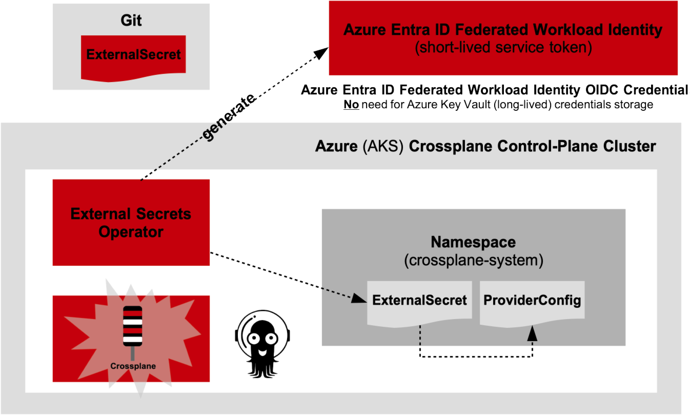

# Crossplane API, Cluster API and ArgoCD (Control Plane) Cluster for Provisioning GCP Container App Platforms
Crossplane, Crossplane GCP Provider and ArgoCD Kubernetes-Native Provisioning of GCP GKE, GCP Cloud Run and GCP App Engine Drone Attack Sortie App Services (Rust and Go)


## Archictural Workflow of CNCF Kubernetes-Native Resources Provisioning (Crossplane and ArgoCD)

Crossplane provides a Control-Plane-Oriented (CPO) GitOps-driven auto-drift-detection and auto-drift-delta reconcilation with defensive regulative guards to prevent sidedoor changes NOT recorded in Git as the source of truth. Crossplane uses "Control-Theory" state-machine logic to constantly analyze the desired state of resource configuraitions in Git and auto-sync (reconcile) the differences to guarantee the live state (the live state of cloud resources or scoped resources in Kubernetes Clusters such as cluster apps and cluster add-ons are gang-synced without drift gaps).

Crosspane API resources are driven to Git as Kubernetes Custom Resources using its CRDs that are installed on the Kubernetes Cluster. Crossplane is extended to a full GitOps driven workflow referencing a GitOps agent controller to coordinate the auto-drift detection changes in Git that deviate from the live state in the cloud or Kubernetes workload Clusters. These Kubernetes-Native GitOps agents are.

- ArgoCD with ApplicationSet Controller to provision at-scale ArgoCD Applications along with a Progressive Delivery agent such as Argo Rollouts (for doing red-black deployments...).

- FluxCD to provision at-scale Flux `Kustomizations` along with a Progressive Delivery agent such as  FluxCD Flagger (for doing red-black deployments ...).

There is no non-declarative approach to delivery, unlike non-declarive CI/CD workflows with Terraform that are NOT GitOps.

- Terraform Plan/Apply workflows in (GitHub Actions CI/CD Workflows, GitLab CI/CD Pipelines ...) even if included with `.precommit` Git checks,Terraform resource code policy checks in the workflows using CNCF `Checkov` (see checkov.io) where the Terraform Plan workflow artifact is cached persisted and PR approved to trigger the Terraform Apply workflow. 

- Terraform IF coupled with a Kubernetes GitOps controller such as ArgoCD Terraform GitOps Controller or FluxCD Terraform GitOps Controller to watch Git for Terraform configuration changes pushes Terraform closer to GitOps delivery cycle however it is still half-GitOps (not fully). This is Half-Ops. This is the ceiling to Terraform.

As clients call on pre-recorded to Git Terraform modules using `module` syntax and juxtapose these modules (modules interconnected as its outputs are inputs to the next module) all called from the root module (the client through the GitFlow pipelines), the clients are faced with the high-cognitive load of understanding Terraform. Terraform does **NOT** allow low-cognitive load for application groups to self-service and deliver the autonomy without the assistance of platform service groups to intervene and slow velocity of delivering their application required resources. To aid this handicap, work is required to provide low-cognitive load service catalog driven headless CLIs or UI dashscreens to provide inventory selection that accepts only high-level client input of what is required to provision while all the high-cognitive lower-level details of the resource configurations are pre-packaged in Git (Terraform modules) and done at the platform servicing group level. The platform developer groups are slowed as they cannot fully dedicate concentrate on only providing resource APIs while constantly guiding and supervising application groups through the process of deploying their resources. The separation of concerns worklfows are not divided.

Crossplane provides a `claim` as serving as a requests for a resource or a coordinated workflow of resources. The clients (application groups) do NOT need to know anything of Crossplane or Kubernetes. The clients would correcty call on a headless CLI to prompt for high-level application-specific inputs or a web-driven UI dashscreen to pull for high-level high-level application-specific inputs using a `Service Options Configuration` design pattern and dispatch this required collection of selected resources to Git. This API takes the collection of inputs, packages its expertise in the configuration and writes this as a Crossplane CR API claim to Git. This packaging processs requires high-degree of opinionated decision proceesing as all of the expertise to provision this is lifted away from application groups. The Crossplane CR API claim or collection of CR API claims written (pushed) to Git triggers ArgoCD to auto-deploy the collected Crossplane requests to create the entire resouces to the target (cloud resources or cloud offered Kubernetes clusters or even off-cloud Kubernetes clusters). Crossplane can create VMs off-cloud, VMs on-cloud and VPCs, storage resources that Terraform can provide without any explicit CI/CD workflows to acheive the results. The workflow is pure Gitflow.

This Kubernetes-Native way of provisioning resources against higher-cognitive templated ways using Terraform is the only way to provide self-service delivery of cloud and Kubernetes resources at-scale and disaster recovery awareness.

The Crossplane equivalent structure of Terraform modules is through a templated architecture of packaging as provided in the Git repo. See the next section `Crossplane XRD API Structure`.


## Crossplane XRD API Structure (Helm)
```
├── crossplane
│   ├── Chart.yaml                      
│   ├── packages
│   │   ├── gcp-apigee                  
│   │   │   ├── templates
│   │   │   │   ├── claim.yaml
│   │   │   │   ├── composition.yaml
│   │   │   │   └── xrd.yaml
│   │   │   └── values.yaml
│   │   ├── gcp-app-engine
│   │   │   ├── templates
│   │   │   │   ├── claim.yaml
│   │   │   │   ├── composition.yaml
│   │   │   │   └── xrd.yaml
│   │   │   └── values.yaml
│   │   ├── gcp-cloudrun
│   │   │   ├── templates
│   │   │   │   ├── claim.yaml
│   │   │   │   ├── composition.yaml
│   │   │   │   └── xrd.yaml
│   │   │   └── values.yaml
│   │   ├── gcp-databases
│   │   │   ├── templates
│   │   │   │   ├── gcp-firestore-claim.yaml
│   │   │   │   ├── gcp-firestore-composition.yaml
│   │   │   │   ├── gcp-firestore-xrd.yaml
│   │   │   │   ├── gcp-spanner-claim.yaml
│   │   │   │   ├── gcp-spanner-composition.yaml
│   │   │   │   └── gcp-spanner-xrd.yaml
│   │   │   └── values.yaml
│   │   ├── gcp-eventarc                  
│   │   │   ├── templates
│   │   │   │   ├── claim.yaml
│   │   │   │   ├── composition.yaml
│   │   │   │   └── xrd.yaml
│   │   │   └── values.yaml
│   │   ├── gcp-gke                       
│   │   │   ├── templates
│   │   │   │   ├── claim.yaml
│   │   │   │   ├── composition.yaml
│   │   │   │   └── xrd.yaml
│   │   │   └── values.yaml
│   │   ├── gcp-networking                
│   │   │   ├── templates
│   │   │   │   ├── claim.yaml
│   │   │   │   ├── composition.yaml
│   │   │   │   └── xrd.yaml
│   │   │   └── values.yaml
│   │   └── gcp-pubsub                    
│   │       ├── templates
│   │       │   ├── claim.yaml
│   │       │   ├── composition.yaml
│   │       │   └── xrd.yaml
│   │       └── values.yaml
│   ├── values-nonprod.yaml
│   ├── values-preprod.yaml
│   ├── values-prod.yaml
│   ├── values-uat.yaml
│   └── values.yaml
├── crossplane-pkg
│   ├── crossplane-pkg-request-cli
│   └── spec-README.md
```

A view into how to provide the packaging for GCP GKE Cluster is provided here with the three required CRs.

- xrd.yaml (CompositeResourceDefinition resource)
- composition.yaml (Composition resource)
- claim.yaml ()

The `XRD` (CompositeResourceDefinition) for GCP GKE Cluster is as follows.

```
apiVersion: apiextensions.crossplane.io/v1
kind: CompositeResourceDefinition
metadata:
  name: xgcpgke.enginevector.io
spec:
  group: gke.enginevector.io
  names:
    kind: XGCPGKE
    plural: xgcpgkes
  claimNames:
    kind: GCPGKEClaim
    plural: gcpgkeclaims
  versions:
    - name: v1alpha1
      served: true
      referenceable: true
      schema:
        openAPIV3Schema:
          type: object
          properties:
            spec:
              type: object
              properties:
                projectId:
                  type: string
                clusterName:
                  type: string
                region:
                  type: string
                nodeCount:
                  type: integer
              required:
                - projectId
                - clusterName
                - region
```

The `Composition` for GCP GKE Cluster is as follows.

```
apiVersion: apiextensions.crossplane.io/v1
kind: Composition
metadata:
  name: gcp-gke
spec:
  compositeTypeRef:
    apiVersion: gke.enginevector.io/v1alpha1
    kind: XGCPGKE
  resources:
    - name: gke-cluster
      base:
        apiVersion: container.gcp.crossplane.io/v1beta1
        kind: Cluster
        spec:
          forProvider:
            location: {{ .Values.gke.region }}
            initialNodeCount: {{ .Values.gke.nodeCount }}
            networkRef:
              name: {{ .Values.gke.networkRef }}
          providerConfigRef:
            name: {{ .Values.gke.providerConfig }}
      patches:
        - fromFieldPath: "spec.clusterName"
          toFieldPath: "metadata.name"
        - fromFieldPath: "spec.region"
          toFieldPath: "spec.forProvider.location"
        - fromFieldPath: "spec.nodeCount"
          toFieldPath: "spec.forProvider.initialNodeCount"
```

The `Claim` for GCP GKE Cluster is as follows.

```
apiVersion: gke.example.com/v1alpha1
kind: GCPGKEClaim
metadata:
  name: gke-claim
spec:
  projectId: {{ .Values.projectId }}
  clusterName: {{ .Values.gke.clusterName }}
  region: {{ .Values.gke.region }}
  nodeCount: {{ .Values.gke.nodeCount }}
```

**This pattern of Crossplane resources follows in the rest of the 10 GCP resources.**


To provision the resources to Git and trigger ArgoCD to deploy the GCP resources to target GCP cloud project the following workflow is.


```shell
cd crossplane-pkg/crossplane-pkg-request-cli
cargo run -- request --project-name drone-colony \
  --gke \
  --cloudrun \
  --appengine \
  --apigee \
  --spanner \
  --firestore \
  --pubsub \
  --eventarc \
  --networking \
  --iam
```

Profile of the proceeding CLI issuance is as follows.

- `--project-name drone-colony` Assigns a unique name to all claims.
- `--gke` Creates GKE Cluster Claim (gcp-gke-claim.yaml in `crossplane-pkg/`)  
- `--cloudrun` Creates Cloud Run Service Claim (gcp-cloudrun-claim.yaml in `crossplane-pkg/`)
- `--appengine` Creates App Engine Claim (gcp-appengine-claim.yaml in `crossplane-pkg/`)
- `--apigee` Creates Apigee API Gateway Claim (gcp-apigee-claim.yaml in `crossplane-pkg/`)
- `--spanner` Creates Spanner DB Claim (gcp-spanner-claim.yaml in `crossplane-pkg/`) 
- `--firestore` Creates GCP Firestore Database Claim (gcp-firestore-claim.yaml in `crossplane-pkg/`)
- `--pubsub` Creates GCP Pub/Sub Claim (gcp-pubsub-claim.yaml in `crossplane-pkg/`)
- `--eventarc`  Creates GCP EventArc Trigger Claim (gcp-eventarc-claim.yaml in `crossplane-pkg/`)
- `--networking` Creates Networking (VPC, Firewall, Private Link Claim (gcp-networking-claim.yaml in `crossplane-pkg/`)
- `--iam` Creates IAM Permissions Claim (gcp-iam-claim.yaml in `crossplane-pkg/`)

This uses the `Multple Claim Crossplane Model`.


## Crossplane XRD API Request (Claim) Architecture Workflow

**Prerequsites for the workflow

- Docker
- Kubernetes Cluster (GCP)
- GCP Cloud Account 
- Helm 3.12+
- ArgoCD Helm Chart Installed w/ ArgoCD ApplicationSet Controller enabled (default is disabled)
    - Deploys to `argocd` namespace
- Crossplane Helm Chart Installed
    - Deploys to `crossplane-system` namespace


To change the sources 

- Requires Go 1.23+
- Requires Rust 1.75+


## GCP Applications (GCP GKE App, GCP CloudRun App, GCP AppEngine App*)

The following applications are provided for this project.

- Double A*Star Pathfinding Drone Sortie Tracking and Status for GCP GKE App
    - Double A*Star Algorithm is a derivative of Ant Colony (Follow-the-Leader) Variant
    - Developed in **Rust** 
    - Runs autonomously without external API requests.
    - Stores sortie status progressions to GCP Spanner DB
        - Syncs to GCP Spanner DB at 25 Waypoint Radio Towers
    - Provides the following project crates:
        - `drones` Drone Convoy Sortie Logic
        - `data-storage` Structs, GCP Spanner Connections, Read/Write APIs

- Double A*Star Pathfinding Drone Sortie Tracking and Status for GCP CloudRun App
    - Double A*Star Algorithm is a derivative of Ant Colony (Follow-the-Leader) Variant
    - Developed in **Rust**
    - Runs autonomously without external API requests.
    - Stores sortie status progressions to GCP Firestore NoSQL DB
        - Syncs to GCP Firestore DB at 25 Waypoint Radio Towers

**See for Git Addition**
- Double A*Star Pathfinding Drone Sortie Tracking and Status for GCP AppEngine App
    - Double A*Star Algorithm is a derivative of Ant Colony (Follow-the-Leader) Variant
    - Developed in **Go**
    - Runs autonomously without external API requests.
    - Stores sortie status progressions to GCP Firestore NoSQL DB
        - Syncs to GCP Firestore DB at 25 Waypoint Radio Towers


## Installing Crossplane and Crossplane Control-Plane Architecture w/ ArgoCD

To install `Crossplane` in HA configuration using the official Helm Chart.

```shell
helm repo add crossplane-stable https://charts.crossplane.io/stable
helm repo update

helm install crossplane crossplane-stable/crossplane \
  --namespace crossplane-system \
  --create-namespace \
  --set args="{--enable-composition-revisions}" \
  --set replicas=3 \
  --set podDisruptionBudget.enabled=true \
  --set podDisruptionBudget.minAvailable=2 \
  --set leaderElection.enabled=true \
  --set rbacManager.enabled=true \
  --set securityContext.runAsNonRoot=true \
  --set tolerations[0].key="CriticalAddonsOnly" \
  --set tolerations[0].operator="Exists" \
  --set tolerations[1].key="node-role.kubernetes.io/control-plane" \
  --set tolerations[1].operator="Exists"
```

In-Progress


## Cloud Service Account and Crossplane ProviderConfig Workflow

### GCP Workflow

Provisioning GCP service account credentials for the Crossplane `ProviderConfig` is done using a GCP IAM Workload Identity and a Kubernetes Secret using **Kubernetes-Native** `External Secrets Operator` (ESO `ClusterSecretStore` CR and ESO `ExternalSecret` CR).

The workflow is as follows.

Crossplane will reference a Kubernetes ExternalSecret resource that will generate a GCP IAM Workload Indentity Credential. This credential is short-lived and does NOT require additional resource as GCP Cloud Secrets Manager to query at the point of Crossplane ProviderConfig deployment.


### Azure Workflow

Provisioning Azure Entra ID service account credentials for the Crossplane `ProviderConfig` is done using Azure Entra (previously Azure AD) for the Service Account) and a Kubernetes Secret using Kubernetes-Native `External Secrets Operator` (ESO `ClusterSecretStore` CR and ESO `ExternalSecret` CR) and `Azure Entra ID Federated Workload Identity`. Azure Entra ID natively provides OIDC federation. The Kubernetes Service Account (KSA) is directly associated with the Azure Identity.

**The workflow is as follows.**

Crossplane will reference a Kubernetes ExternalSecret resource that will generate a Azure Entra ID Federated Workload Indentity Credential. This credential is short-lived and does **NOT** require additional resource as Azure Key Vault to query at the point of Crossplane `ProviderConfig` deployment.  





### Provider and ProviderConfig Package Deployment for the Crossplane Control-Plane Cluster

To automate the deployment of the Crossplane `Provider` and `ProviderConfig` for the Crossplane Control-Plane Cluster, the required dependencies for this will include. 

- External Secrets Operator (prerequsite)
- Crossplane Operator (prerequisite)
- ArgoCD in HA Configuration (optional) - **Highly advised to include as a prerequisite**


The `Provider Package` Helm Chart will include in the `templates` directory.

- ESO `ExternalSecret` resource
- ESO `ClusterSecretStore` resource
- Crossplane `Provider` and `ProviderConfig` resources

The Helm Chart `Chart.yaml` will include the dependencies for Crossplane, ESO and ArgoCD. 

```shell
crossplane-gitops-control-plane/
├── templates/
│   ├── __helpers.tpl
│   ├── cxp-provider-external-secret.yaml
│   ├── cxp-provider-cluster-secret-store.yaml
│   ├── cxp-provider.yaml
│   ├── cxp-provider-config.yaml
│
├── Chart.yaml
├── values.yaml
├── values-nonprod.yaml
├── values-preprod.yaml
├── values-uat.yaml
├── values-prod.yaml
```


The Chart.yaml is as follows.

```shell
apiVersion: v2
name: crossplane-gitops-control-plane
description: A Helm chart for setting up a GitOps-based Crossplane control plane with ArgoCD and External Secrets Operator.
type: application
version: 1.0.0
appVersion: "1.0.0"

dependencies:
  - name: argo-cd
    version: "5.51.3"  # Match the latest stable version
    repository: "https://argoproj.github.io/argo-helm"

  - name: external-secrets
    version: "0.9.10"  # Match the latest stable version
    repository: "https://charts.external-secrets.io"

  - name: crossplane
    version: "1.14.2"  # Match the latest stable version
    repository: "https://charts.crossplane.io/stable"
```


## ChangeLog

- Develop the Crosplane Service Kit APIs (Go and Rust) the CLI and Dioxus Rust WASM Web UI will call.
- Develop the Crossplane Compositional Functions (Azure, GCP)
- Provide KUTTL API Testing for Crossplane XR APIs


## References

- crossplane.io
- checkov.io
- https://argoproj.github.io/cd/
- https://argoproj.github.io/rollouts/